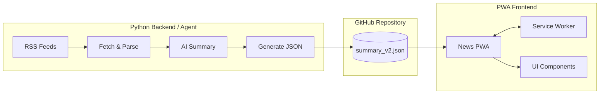

```mermaid
flowchart LR

    %% Backend
    subgraph Backend["Python Backend / Agent"]
        RSS["RSS Feeds"]
        Fetch["Fetch & Parse"]
        Summary["AI Summary"]
        JSON["Generate JSON"]
    end

    %% Storage
    subgraph GitHub["GitHub Repository"]
        Store[(summary_v2.json)]
    end

    %% Frontend
    subgraph Frontend["PWA Frontend"]
        App["News PWA"]
        SW["Service Worker"]
        UI["UI Components"]
    end

    %% Main Flow
    RSS --> Fetch --> Summary --> JSON --> Store --> App

    %% Sub Flow
    App --> UI
    App <--> SW
```

